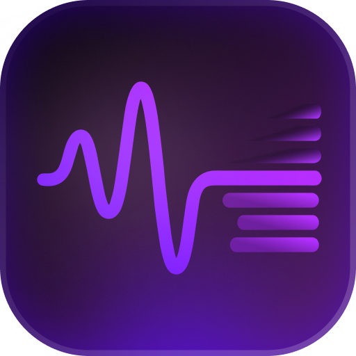

<p align="center">
  
</p>

<h1 align="center">Muse</h1>

<p align="center">
  <strong>Record or drop in audio. Get MIDI back.</strong>
</p>

<p align="center">
  Solo piano with left/right hand split, or full multi-instrument transcription across up to 13 tracks.
</p>

<p align="center">
  <a href="#download">Download</a> •
  <a href="#how-it-works">How It Works</a> •
  <a href="#models--accuracy">Models</a> •
  <a href="#building-from-source">Build</a>
</p>

<p align="center">
  
  
</p>

---

<p align="center">
  <video src="https://github.com/mqtik/muse/raw/main/public/video.webm" autoplay loop muted playsinline width="100%"></video>
</p>

---

## Features

- **Solo Piano** — Demucs isolates the piano from any mix. Transkun V2 transcribes it at 96–97% onset F1 on MAESTRO. PM2S handles left/right hand split, key signature, and time signature.
- **Multi-Instrument** — YourMT3+ transcribes all instruments in one pass, up to 13 tracks, with no source separation step.
- **Built-in Playback** — Grand piano synth with per-track mute/solo. Hear the original audio and your transcription side by side.
- **Record or Upload** — Live mic recording, or drag in MP3, WAV, OGG, or FLAC.
- **Runs Locally** — Native desktop app (Tauri 2). Your audio never leaves your machine.
- **GPU Accelerated** — CUDA and Apple Silicon MPS supported.

---

## Download

Grab the latest build from [**Releases**](https://github.com/mqtik/muse/releases).

| Platform | File |
|----------|------|
| macOS (Apple Silicon) | `Muse_x.x.x_aarch64.dmg` |
| macOS (Intel) | `Muse_x.x.x_x64.dmg` |
| Windows | `Muse_x.x.x_x64-setup.exe` |
| Linux (Debian/Ubuntu) | `muse_x.x.x_amd64.deb` |
| Linux (AppImage) | `Muse_x.x.x_amd64.AppImage` |

You'll need **Python 3.10+** installed. Muse creates its own virtual environment and downloads ML models automatically on first run (~3 GB).

---

## How It Works

### Solo Piano

```
Audio → Demucs htdemucs_6s → Piano stem → Transkun V2 → PM2S → Score MIDI + Performance MIDI
```

1. **Demucs** separates the piano stem from the mix using a 6-source Hybrid Transformer. Pass `--solo-piano` to skip this step if you're feeding a solo recording.
2. **Transkun V2** converts the piano stem to note events (pitch, onset, offset, velocity) using a Transformer + Neural Semi-CRF trained on MAESTRO.
3. **PM2S** post-processes: an RNN splits notes into left/right hand, a second RNN detects key signature, a CNN detects time signature. Sustain pedal goes into the performance MIDI only — the score stays clean.

Output: `song.mid` (score, hand-split) + `song.perf.mid` (performance, with sustain pedal).

### Multi-Instrument

```
Audio → YourMT3+ (YPTF.MoE+Multi) → Multi-track MIDI (up to 13 parts)
```

YourMT3+ transcribes everything in one pass — no source separation needed. Best for full arrangements. CPU inference takes roughly 2 min per 30s of audio; a GPU makes a significant difference.

---

## Models & Accuracy

### Piano Transcription — Transkun V2

| Dataset | Onset F1 | Onset+Offset F1 |
|---------|----------|-----------------|
| MAESTRO (concert piano) | 0.96–0.97 | 0.93–0.95 |
| SMD (synth piano) | 0.92–0.94 | 0.89–0.92 |
| MAPS (real recordings) | 0.78–0.82 | 0.66–0.70 |

Transkun was trained on MAESTRO (Yamaha CFX / Steinway D recordings). Accuracy degrades on synth piano, electric piano, and anything that doesn't sound like a concert grand.

### Multi-Instrument — YourMT3+

YourMT3+ (YPTF.MoE+Multi) is a Mixture-of-Experts Transformer that goes directly from audio to multi-track MIDI. Trained on a large multi-instrument corpus without pitch-shift augmentation, so it generalizes well across genres and recording conditions.

### Hand Separation — PM2S

PM2S assigns each note to a hand using an RNN that understands musical context: voice leading, hand-span constraints, and temporal proximity. Far more reliable than a simple pitch split at middle C, especially on pieces with hand crossings.

| Component | Metric |
|-----------|--------|
| Beat tracking RNN | F1: 0.888 |
| Downbeat tracking RNN | F1: 0.773 |
| Hand part separation RNN | Per-note binary classification |

### Source Separation — Demucs htdemucs_6s

6-stem Hybrid Transformer Demucs (piano, bass, guitar, vocals, drums, other). SDR ~7–9 dB on clean acoustic piano in a mix. Degrades on synth/electric piano and heavily processed or low-quality recordings.

---

## Known Limitations

- **Transkun is trained on concert piano** — Steinway only. Synths, electric pianos, and non-standard timbres will produce worse results.
- **YourMT3+ is slow without a GPU** — ~2 min for 30s on CPU. On long pieces, plan for GPU.
- **Expressive timing is preserved, not quantized** — The score MIDI snaps to the beat grid. Rubato and expressive timing variations are kept in the performance MIDI instead.
- **MIDI only for now** — MusicXML export is on the roadmap.

---

## Building from Source

### Requirements

- [Node.js](https://nodejs.org/) ≥ 18
- [Rust](https://rustup.rs/) (latest stable)
- Python 3.10+
- Tauri 2 platform dependencies — [prerequisites](https://v2.tauri.app/start/prerequisites/)

### Setup

```bash
git clone https://github.com/mqtik/muse.git
cd muse/app
npm install

npm run dev          # Vite dev server + Tauri window
npm run tauri build  # Production build → app/src-tauri/target/release/bundle/
```

The Python environment is created automatically at `~/.audio2sheets/venv/` on first run. To set it up manually:

```bash
python3 -m venv ~/.audio2sheets/venv
~/.audio2sheets/venv/bin/pip install -r python/requirements.txt
```

For multi-instrument mode, clone YourMT3+ into the project root:

```bash
git clone https://github.com/mimbres/YourMT3.git yourmt3
```

---

## Project Structure

```
muse/
├── app/                    Tauri 2 desktop app
│   ├── src/                SolidJS frontend (views, components, stores, lib)
│   └── src-tauri/          Rust backend (pipeline commands, venv setup)
├── python/
│   └── pipeline.py         Dual-backend ML pipeline (Transkun / YourMT3+)
├── src/                    Node.js CLI & library
└── tests/                  Unit, integration, e2e, and browser tests
```

---

## Tech Stack

| Layer | Technology |
|-------|-----------|
| Desktop | [Tauri 2](https://v2.tauri.app/) |
| Frontend | [SolidJS](https://www.solidjs.com/) + [Tailwind CSS 4](https://tailwindcss.com/) |
| Backend | Rust |
| ML Pipeline | Python + [PyTorch](https://pytorch.org/) |
| Piano Transcription | [Transkun V2](https://github.com/Yujia-Yan/Transkun) |
| Multi-Instrument | [YourMT3+](https://arxiv.org/abs/2407.04822) |
| Stem Separation | [Demucs htdemucs_6s](https://github.com/facebookresearch/demucs) |
| Hand Splitting | [PM2S](https://github.com/cheriell/PM2S) (ISMIR 2022) |
| MIDI Playback | [smplr](https://github.com/danigb/smplr) |

---

## Research Notes

### Why these models?

Picking the transcription model required trading off accuracy, runtime, and deployment complexity:

| Model | Params | MAESTRO Onset F1 | Deployable in Node.js |
|-------|--------|-------------------|-----------------------|
| Basic Pitch (Spotify) | ~17K | ~85–90% | Yes (npm) |
| Onsets & Velocities | ~3.1M | 96.78% | Yes (ONNX) |
| Onsets and Frames (Magenta) | ~21M | ~94.8% | Yes (tfjs, unidirectional LSTMs) |
| **Transkun V2** | Medium | **96–97%** | Python subprocess |
| MT3 family | ~300M+ | N/A | No (autoregressive) |

Transkun V2 won on accuracy and a clean Python API. Basic Pitch was an early candidate but its tendency to hallucinate overtones as real notes — harmonics at the 12th, 19th, and 24th above a played note — was difficult to suppress reliably.

**On quantization**: PM2S ships a quantization RNN alongside its hand-splitting model. We measured ~164ms mean onset drift (p95: 385ms) — audible artifacts on anything with fast passages. The hand-splitting RNN is excellent; the quantization RNN is not. We dropped it and ship both a quantized score MIDI and a raw performance MIDI instead.

**On multi-instrument**: Running Demucs → per-stem transcription compounds errors — separation artifacts become transcription errors, which then merge into a broken multi-track output. YourMT3+ handles everything in one shot. Cleaner pipeline, better output.

### Alternatives and prior art

| Tool | Price | Output | Notes |
|------|-------|--------|-------|
| AnthemScore | $29–99 | MusicXML, MIDI | Good for solo piano |
| Klangio | Subscription | MusicXML, MIDI, PDF | Cloud-only |
| Melodyne | $99–699 | MIDI | Strong pitch detection, manual workflow |
| ScoreCloud | Free–$20/mo | MusicXML | Struggles on complex polyphony |
| **Muse** | Free | MIDI | Open-source, runs locally |

---

## License

[MIT](LICENSE)
